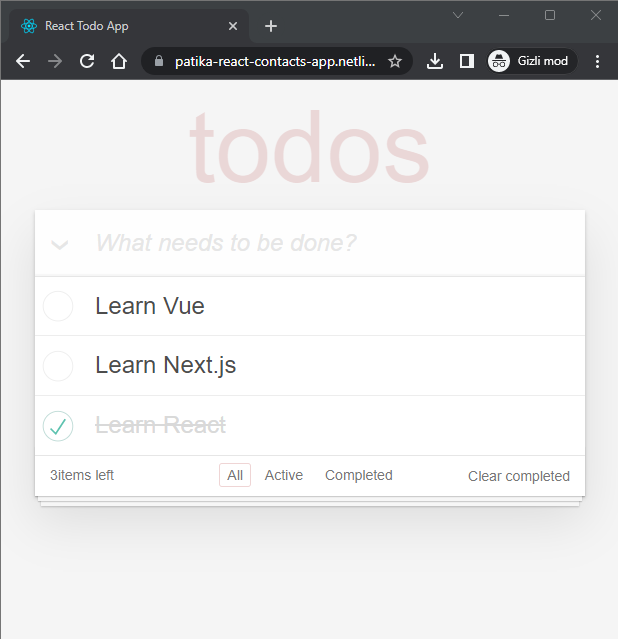

# Patika.dev React Ödev 01

Bu ödev, kullanıcının ekleyebileceği, düzenleyebileceği ve silebileceği basit bir Todo listesi sunar. Kullanıcı, Todo listesindeki öğeleri tamamlandı olarak işaretleyebilir, başlıkları yeniden düzenleyebilir ve silebilir. Uygulama, kullanıcıların tarayıcıda yerel depolama kullanarak Todo öğelerini kaydetmelerine olanak tanır.

## - [Canlı - Live](https://patika-react-contacts-app.netlify.app/)
# Kurulum

Uygulamayı kullanmak için şu adımları izleyin:


1. Bu depoyu kopyalayın:

```bash
git clone https://github.com/biskendr/Patika.dev-react
cd Patika.dev-react/react-odev-01
```

2. Bağımlılıkları yükleyin:

```bash
npm install
```

3. Uygulamayı başlatın:

```bash
npm run dev
```

4. Uygulamayı görüntülemek için tarayıcınızda http://localhost:3000 veya http://127.0.0.1:5173/ adresine gidin.


# Ekran Görüntüsü



# Gereksinimler

- Aşağıda çalışır hali paylaşılan çalışmayı bir React uygulaması olarak çalışır hale getirmek.

- [Çalışmanın orijinal hali](https://codepen.io/dmitrysharabin/pen/MWgQNYZ)

- [HTML & CSS](https://codepen.io/mehmetseven/pen/OJRzLjV)

- Yukarıda paylaşılan ikinci bağlantıda orijinal çalışmada bulunan ancak sizin işinize yaramayacak olan tanımlar kaldırıldı. O bağlantıdaki HTML ve CSS tanımlarını kullanarak geliştirmeye başlayabilirsiniz.

- Dosya dizin isimlendirmesini dilediğiniz gibi yapabilirsiniz.
