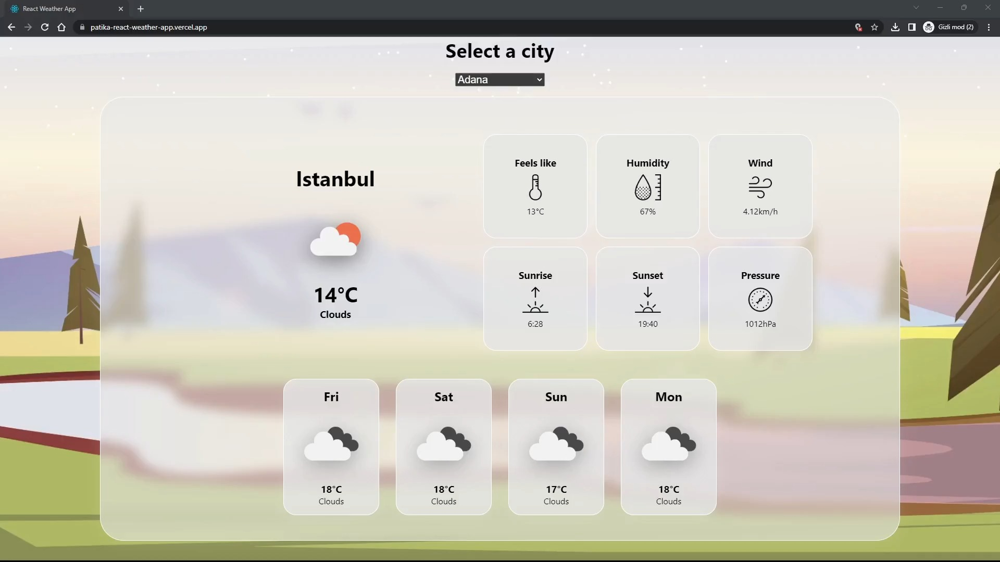
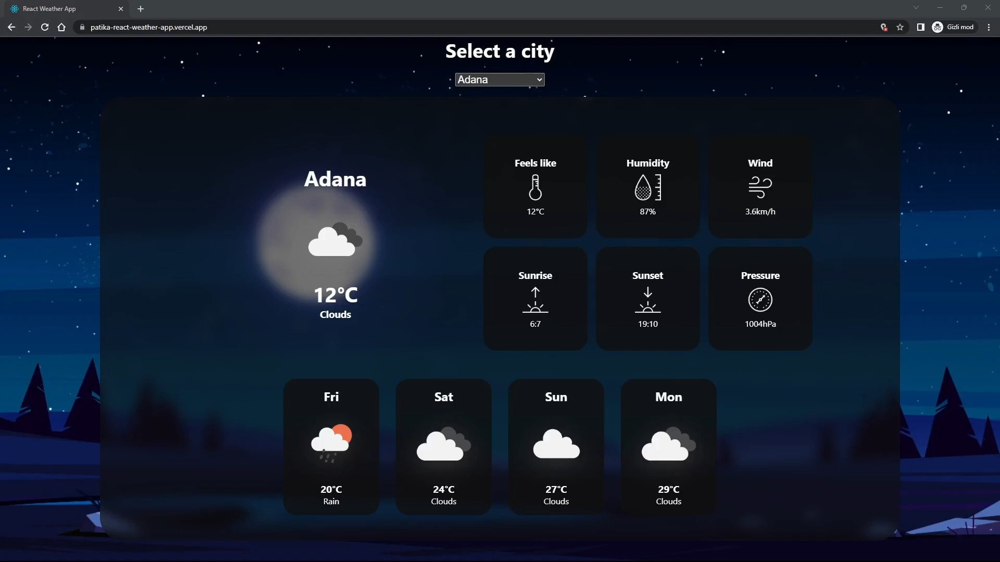

# Patika.dev React Ödev 02

Bu ödev, hava durumu bilgileri sağlayan [openweather](https://openweathermap.org/api) API kullanılarak yapılmıştır. Uygulama, listeden seçilen şehirin detaylı hava durumu bilgisini ve gelecek 5 günlük hava durumu tahminini kullanıcya gösteren bir uygulamadır.

## - [Canlı - Live](https://patika-react-weather-app.vercel.app/)

# Kurulum

Uygulamayı yerel cihazınınzda çalıştırmak için şu adımları izleyin:

1. Bu depoyu kopyalayın ve klasörü açın:

```bash
git clone https://github.com/biskendr/Patika.dev-react
cd Patika.dev-react/react-odev-01
```

2. Örnek '.env.sample' dosyasının kopyasını '.env' ismiyle oluşturun:

```bash
cp .env.sample .env
```

3. Dosyayı açıp ilgili alana ürün anahtarınızı yerleştirin:

```bash
code .env
# or
nano .env
```

4. Bağımlılıkları yükleyin:

```bash
npm install
```

5. Uygulamayı başlatın:

```bash
npm run dev
```

6. Uygulamayı görüntülemek için tarayıcınızda http://localhost:3000 adresine gidin.

# Ekran Görüntüsü

<div align="center">
  


  
</div>

# Gereksinimler

Sizden genel olarak bir hava durumu uygulaması geliştirmeniz bekleniyor. Türkiye'nin tüm illerinin bir haftalık hava raporunu görüntüleyebilmeliyiz.

Ekran aşağıdaki görseldeki gibi olacaktır.


### Uygulama Gereksinimleri

- Uygulama, Context API kullanılarak geliştirilmelidir.

- Hava raporunda görüntülenen veriler tamamen gerçeği yansıtmalıdır. Hava durum bilgilerine erişmek için OpenWeather API kullanılabilir. Veya dilediğiniz farklı bir API'ı da kullanabilirsiniz.

- Hava raporu, içinde bulunduğumuz günden başlayarak önümüzdeki bir haftalık süreci yansıtacaktır. Yukarıdaki görseli referans alabilirsiniz.

- Sayfa ilk açıldığında varsayılan olarak dilediğiniz herhangi şehrin hava durumunu gösterebilirsiniz. Bu noktada yapmak isteyenler için kullanıcıdan konum erişim izni istenerek bulunduğu şehrin bilgileri varsayılan olarak gösterilebilir.

- Yine yukarıdaki görselde görüleceği üzere, içinde bulunduğumuz gün, bir background ve border ile belirginleştirilmelidir.

- Günlerin listelendiği kartlarda; gün adı, hava durumu görseli(güneşli, yağmurlu, karlı, parçalı bulutlu), en yüksek ve en düşük sıcaklık gösterilmelidir.

- Bir dropdown aracılığı ile farklı bir şehrin hava raporuna ulaşılabilmelidir.
